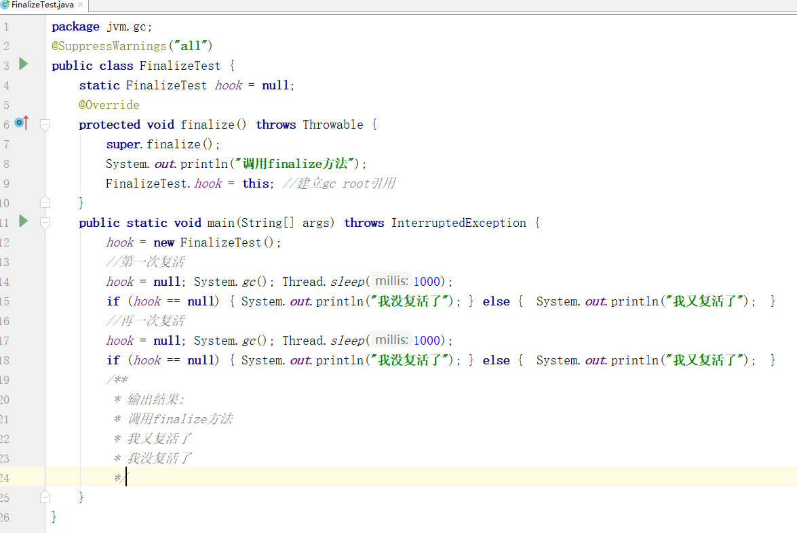
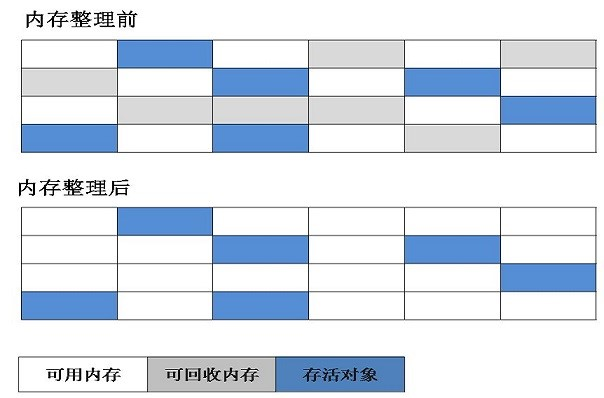
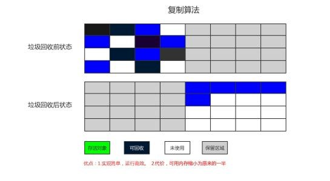
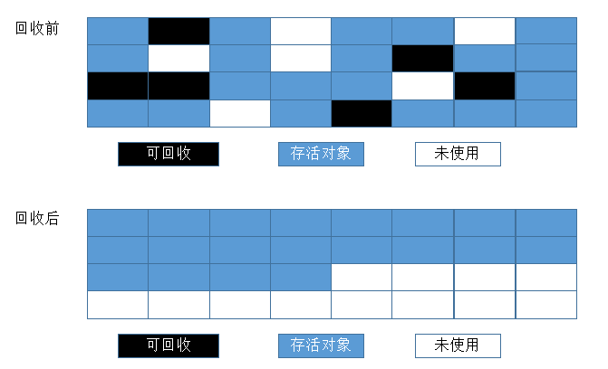
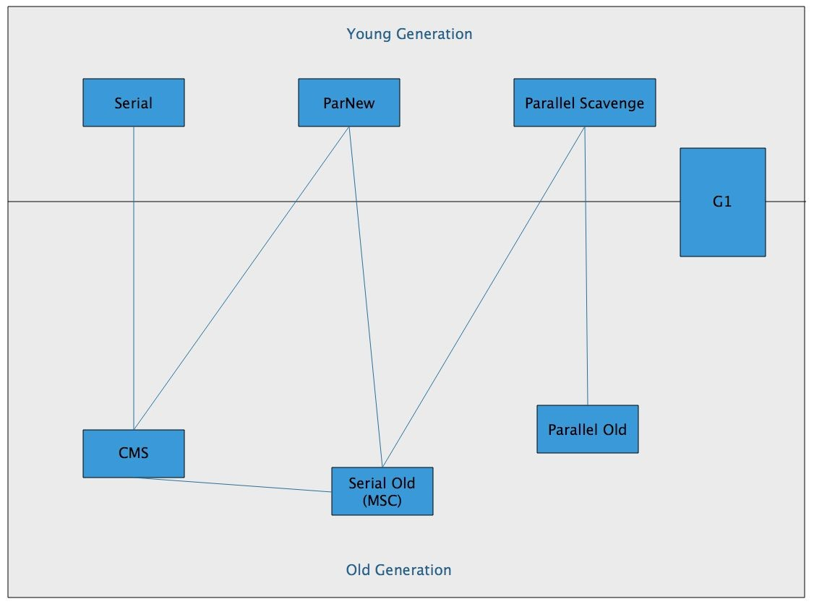
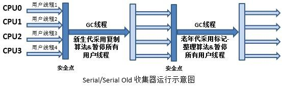
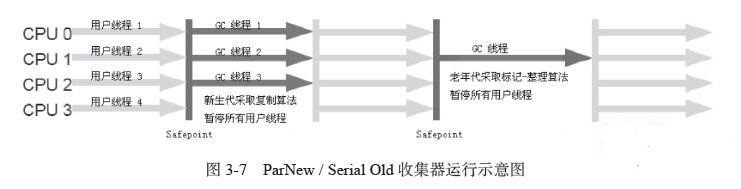
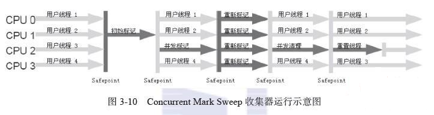
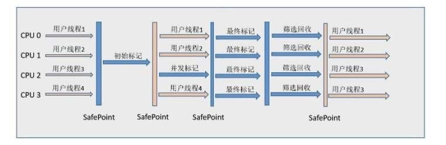

# 垃圾收集器和内存分配策略

## 对象是否可回收

垃圾收集器在对堆内存进行回收前要确定哪一些对象可以被回收，主要有以下2种算法。

### 1.引用计数算法

给对象添加一个引用计数器，每有一个地方引用次对象，计数器加1；当引用失效是计数器减一。计数器为0的对象就是没有引用的对象，可以被回收。这种算法实现简单，效率也很高。但是Java虚拟机中并没有使用次算法来管理内存，主要原因就是很难解决对象相互循环引用的问题。例如A引用B,B引用A，实际上A,B两个对象已经不可被访问了，但是由于互相引用导致无法被回收。

### 2.可达性分析算法

这个算法主要是同过一系列的GC root对象作为起始点，从这些节点开始向下搜索，搜索路径被称为引用链，当一个对象到GC root没有任何引用链相连时，则说明次对象是不会被访问的。可以被判定为是可回收的对象。
    
>在JAVA中，可以作为GC root的对象主要有以下几种：
>
>+	虚拟机栈（帧栈中的本地变量表）中引用的对象。
>+	方法区中类静态属性引用的对象
>+	方法区中常量引用的对象
>+	本地方法栈中JNI（即Native）引用的对象

### 3.引用类型

无论是引用计数算法还是可达性分析算法，判定对象是否存活的引用类型都有4种：强引用（Strong Reference）、软引用（Soft Reference）、弱引用（Weak Reference）、虚引用（Phantom Reference） ，这4种引用强度依次减弱。
+ 强引用：类似 Object A = new Object这种属于强引用，只要引用还在，就不会被回收。
+ 软引用：在系统发生溢出异常之前，会把软引用的对象列入回收范围进行第二次回收，如果这次回收内存还是不足，才会抛出内存溢出异常。使用SoftReference类实现弱引用
+ 弱引用：与软引用类似，但是强度要更弱一些，被弱引用关联的对象只能生存到下一次垃圾收集发生之前。当垃圾收集器工作时，无论内存是否足够，都会回收弱引用关联的对象。使用WeakReference类实现弱引用。
+  虚引用：一个对象是否有虚引用不会对其生存时间构成影响，也无法通过虚引用来取得一个对象的实例。为一个对象设置虚引用关联的唯一目的就是在这个对象被回收时收到一个系统通知。使用PhantomReference类来实现虚引用。

### 4.finalize方法

不可达的对象真正死亡，至少要经历两次标记过程，第一次发现不可达时，将会被第一次标记并且进行一次筛选，筛选条件时次对象有没有必要执行finalize()方法。当对象没有覆盖此方法，或者已经调用过一次此方法，则会被认为是没有必要执行。

如果有必要执行finalize（）方法，此对象会被放到一个F-Queue队列中，并由一个虚拟机建立的、低优先级的Finalizer线程去执行触发finalize（）方法，但是并不保证会等待方法运行完。

Finalize方法是对象拯救自己的最后一次机会，与gc root重新建立引用链。但是只会有一次复活的机会，下一次被标记为不可达时，就不会调用此方法复活了。从以下测试程序中可以看到第一次hook拯救了自己，但是第二次就没有调用finalize方法了，导致无法复活。

## 垃圾收集算法

### 1.标记-清除算法
	
算法分为标记和清除两个阶段；首先标记出所有需要回收的对象，在标记完成后统一进行回收所有被标记的对象。标记-清楚算法主要有2个不足：一个是效率问题，标记和清除两个过程效率都不高；另一个是空间问题，标记清除后会产生大量不连续的碎片，碎片过多会导致分配大对象时无法找到足够的连续内存而提前触发垃圾收集。

### 2.复制算法

将容量分为大小相等的两块，每次只使用一块。当这一块内存使用完了，就把还存活的对象复制到另一块内存，然后把已使用过的内存空间一次清理。这样可以每次都对整个半区清理，内存分配时就不需要考虑碎片等复杂情况，只要移动指针，按顺序分配即可，实现简单，运行高效。缺点就是浪费内存空间。

现在虚拟机大部分使用这种方式来收集新生代空间，IBM公司的专门研究表明，新生代中的对象98%是“朝生夕死“的，所以并不需要按照1：1空间划分内存空间，而是将内存分为一块较大的Eden空间和两块较小的Survivor空间，每次使用Eden和其中一块Survivor。当回收时将Eden和Survivor中还存活的对象一次复制到另一块Survivor空间中，最后清理Eden和另一块Survivor空间。HotSpot虚拟机默认分配比例时8：1：1。

在回收时并没有办法保证每次回收都只有不多于10%的对象存活，所以当Survivor空间不够时，需要依赖老年代进行分配担保。如果另外一块空间没有足够的空间存放上一次新生代存活的对对象，这些对象就会直接进入老年代。

### 3.标记-整理算法

复制算法在对象存活率较高时会进行比较多的复制操作，效率就会比较低。更关键的是如果不想浪费一半的空间，就需要额外的空间进行分配担保，用来应对所有对象都存活的极端情况，所以在老年代一般不能直接使用复制算法。

根据老年代的特点，就提出了标记-整理算法，标记过程与标记-清除一样，但是后续步骤不是直接对可回收对象进行清理，而是让所有存活对象都向一端移动，然后直接清理掉边界以外的内存。

### 4.分代收集算法

根据对象的存活周期不同，将内存分为几块，一般是新生代和老年代，然后根据不同年代的特点选择不同的收集算法。新生代每次收集都有大量对象死去，只有少部门存活，就可以使用复制算法，只需要复制出少量对象就可以完成收集。而老年代存活率高，没有额外空间担保分配，就必须使用呢标记-清理，或者标记-整理算法。

## 垃圾收集器

不同厂商、不同版本的虚拟机提供的垃圾收集器可能会有很大区别，并且一般都会提供参数供用户根据自己的应用组合各个年代所使用的收集器。这里主要列举HotSpot虚拟机包含的收集器。

### 1.Serial收集器

Serial收集器是一个单线程的收集器，只会使用一个CPU或一条收集线程去完成垃圾收集工作，在进行垃圾收集时，必须暂停所有其他的工作线程，直到收集结束。

### 2.ParNew收集器

ParNew收集器时serial的多线程版本，除了使用多线程进行垃圾收集外，其余行为都与Serial相同。

ParNew收集器是许多运行在Server模式下的虚拟机中首选的新生代收集器，其中有一个与性能无关但很重要的原因是，除了Serial收集器外，目前只有它能与CMS收集器配合工作。

### 3.Parallel Scavenge收集器

>+ Parallel Scavenge收集器是一个新生代收集器，它也是使用复制算法的收集器，又是并行的多线程收集器
>+ Parallel Scavenge收集器的目标则是达到一个可控制的吞吐量（Throughput）Parallel Scavenge收集器提供了两个参数用于精确控制吞吐量，分别是控制最大垃圾收集停顿时间的-XX:MaxGCPauseMillis参数以及直接设置吞吐量大小的-XX:GCTimeRatio参数。MaxGCPauseMillis参数允许的值是一个大于0的毫秒数，收集器将尽可能地保证内存回收花费的时间不超过设定值。停顿少，垃圾收集就更频繁，吞吐量就降下来了

Parallel Scavenge收集器还有一个参数-XX:+UseAdaptiveSizePolicy值得关注。这是一个开关参数，当这个参数打开之后，就不需要手工指定新生代的大小（-Xmn）、Eden与Survivor区的比例（-XX:SurvivorRatio）、晋升老年代对象年龄（-XX:PretenureSizeThreshold）等细节参数了，虚拟机会根据当前系统的运行情况收集性能监控信息，动态调整这些参数以提供最合适的停顿时间或者最大的吞吐量，这种调节方式称为GC自适应的调节策略（GC Ergonomics）。自适应调节策略也是Parallel Scavenge收集器与ParNew收集器的一个重要区别。

### 4.Serial Old收集器

Serial Old是Serial收集器的老年代版本，它同样是一个单线程收集器，使用“标记－整理”算法。

这个收集器的主要意义也是在于给Client模式下的虚拟机使用。如果在Server模式下，那么它主要还有两大用途：一种用途是在JDK 1.5以及之前的版本中与Parallel Scavenge收集器搭配使用，另一种用途就是作为CMS收集器的后备预案，在并发收集发生Concurrent Mode Failure时使用。

### 5.Paralled Old收集器

Parallel Old是Parallel Scavenge收集器的老年代版本，使用多线程和“标记－整理”算法。在注重吞吐量以及CPU资源敏感的场合，都可以优先考虑Parallel Scavenge加Parallel Old收集器。

### 6.CMS收集器

CMS（Concurrent Mark Sweep）收集器是一种以获取最短回收停顿时间为目标的收集器。（互联网应用，B/S系统服务端等注重响应速度的应用）CMS收集器是基于“标记—清除”算法实现的，它的运作过程相对于前面几种收集器来说更复杂一些，整个过程分为4个步骤，包括：

>1. 初始标记（CMS initial mark）
>2. 并发标记（CMS concurrent mark）
>3. 重新标记（CMS remark）
>4. 并发清除（CMS concurrent sweep）

初始标记、重新标记这两个步骤仍然需要“Stop The World”（停顿其他线程）初始标记仅仅只是标记一下GC Roots能直接关联到的对象，速度很快，并发标记阶段就是进行GC Roots Tracing的过程，而重新标记阶段则是为了修正并发标记期间因用户程序继续运作而导致标记产生变动的那一部分对象的标记记录

### 7.G1收集器

G1收集器的特点
+ 并行与并发：G1能充分利用多CPU、多核环境下的硬件优势，使用多个CPU（CPU或者CPU核心）来缩短Stop-The-World停顿的时间，部分其他收集器原本需要停顿Java线程执行的GC动作，G1收集器仍然可以通过并发的方式让Java程序继续执行。
+ 分代收集：与其他收集器一样，分代概念在G1中依然得以保留。虽然G1可以不需要其他收集器配合就能独立管理整个GC堆，但它能够采用不同的方式去处理新创建的对象和已经存活了一段时间、熬过多次GC的旧对象以获取更好的收集效果。
+ 空间整合：与CMS的“标记—清理”算法不同，G1从整体来看是基于“标记—整理”算法实现的收集器，从局部（两个Region之间）上来看是基于“复制”算法实现的，但无论如何，这两种算法都意味着G1运作期间不会产生内存空间碎片，收集后能提供规整的可用内存。这种特性有利于程序长时间运行，分配大对象时不会因为无法找到连续内存空间而提前触发下一次GC。
+ 可预测的停顿：这是G1相对于CMS的另一大优势，降低停顿时间是G1和CMS共同的关注点，但G1除了追求低停顿外，还能建立可预测的停顿时间模型，能让使用者明确指定在一个长度为M毫秒的时间片段内，消耗在垃圾收集上的时间不得超过N毫秒，这几乎已经是实时Java（RTSJ）的垃圾收集器的特征了。

G1收集器的运作大致可划分为以下几个步骤：

+ 初始标记（Initial Marking）
+ 并发标记（Concurrent Marking）
+ 最终标记（Final Marking）
+ 筛选回收（Live Data Counting and Evacuation）

## 内存分配与回收策略

对象主要分配在新生代的Eden区上，如果启动了本地线程分配缓冲，将按线程优先在TLAB（本地线程分配缓冲，即每个线程预先在堆中分配一小块内存，通过-XX：+/-UseTLAB参数设置）上分配。少数情况下也可能会直接分配在老年代中，分配的规则并不是百分之百固定的，其细节取决于当前使用的是哪一种垃圾收集器组合，还有虚拟机中与内存相关的参数的设置。

### 1.对象优先在Eden分配

新生代GC（Minor GC）：指发生在新生代的垃圾收集动作，因为Java对象大多都具备朝生夕灭的特性，所以Minor GC非常频繁，一般回收速度也比较快。

老年代GC（Major GC / Full GC）：指发生在老年代的GC，出现了Major GC，经常会伴随至少一次的Minor GC（但非绝对的，在Parallel Scavenge收集器的收集策略里就有直接进行Major GC的策略选择过程）。Major GC的速度一般会比Minor GC慢10倍以上。
 
### 2.大对象直接进入老年代

大对象是只需要大量连续内存空间的Java对象，例如很长的字符串和数组。虚拟机提供了-XX:PretenureSizeThreshold参数，当对象大于这个值的时候直接分配到老年代。只对Serial和ParNew两款收集器有效，Parallel Scavenge收集器不认识这个参数，Parallel Scavenge收集器一般并不需要设置。如果遇到必须使用此参数的场合，可以考虑ParNew加CMS的收集器组合。

### 3.长期存活的对象将进入老年代

如果对象在Eden出生并经过第一次Minor GC后仍然存活，并且能被Survivor容纳的话，将被移动到Survivor空间中，并且对象年龄设为1。对象在Survivor区中每“熬过”一次Minor GC，年龄就增加1岁，当它的年龄增加到一定程度（默认为15岁），就将会被晋升到老年代中。对象晋升老年代的年龄阈值，可以通过参数-XX:MaxTenuringThreshold设置。

### 4.动态对象年龄谈判

为了能更好地适应不同程序的内存状况，虚拟机并不是永远地要求对象的年龄必须达到了MaxTenuringThreshold才能晋升老年代，如果在Survivor空间中相同年龄所有对象大小的总和大于Survivor空间的一半，年龄大于或等于该年龄的对象就可以直接进入老年代，无须等到MaxTenuringThreshold中要求的年龄。

### 5.空间分配担保

在发生Minor GC之前，虚拟机会先检查老年代最大可用的连续空间是否大于新生代所有对象总空间，如果这个条件成立，那么Minor GC可以确保是安全的。如果不成立，则虚拟机会查看HandlePromotionFailure设置值是否允许担保失败。如果允许，那么会继续检查老年代最大可用的连续空间是否大于历次晋升到老年代对象的平均大小，如果大于，将尝试着进行一次Minor GC，尽管这次Minor GC是有风险的；如果小于，或者HandlePromotionFailure设置不允许冒险，那这时也要改为进行一次Full GC。

