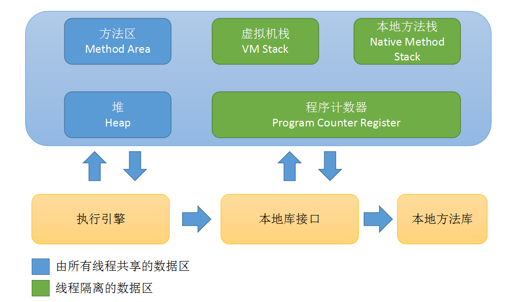

<!--
title: JVM内存模型
keywords: JVM内存模型,内存模型,JVM
date: 2019-05-04 21:30:35
-->
# JVM内存模型

## JVM内存模型

Java虚拟机定义了若干种程序运行期间会使用到的运行时数据区，其中有一些会随着虚拟机启动而创建，随着虚拟机退出而销毁。另外一些则是与线程一一对应的，这些与线程对应的数据区域会随着线程开始和结束而创建和销毁。

### 内存模型

 
 
## 程序计数器

每个线程都有各自的程序计数器，用来保存线程下一条要执行的字节码指令。当线程执行的是一个Java方法时，计数器记录的是正在执行的虚拟机字节码指令的地址；如果在执行的是一个本地方法(Native)，计数器的值为空。

## Java虚拟机栈

每一条Java虚拟机线程都有自己私有的Java虚拟机栈，这个栈与线程同时创建，用于存储栈帧。Java虚拟机栈用于存储局部变量表、方法出口与一些过程结果的地方。每一个方法从调用到执行完成就对应一个帧栈的入栈和出栈。栈帧可以在堆中分配，Java虚拟机栈所使用的内存不需要保证是连续的。 
    
Java虚拟机规范允许Java虚拟机栈被实现成固定大小的或者是根据计算动态扩展和收缩的。如果采用固定大小的Java虚拟机栈设计，那每一条线程的Java虚拟机栈容量应当在线程创建的时候独立地选定。Java虚拟机实现应当提供给程序员或者最终用户调节虚拟机栈初始容量的手段，对于可以动态扩展和收缩Java虚拟机栈来说，则应当提供调节其最大、最小容量的手段。 
    
Java虚拟机栈可能发生如下异常情况： 
- 如果线程请求分配的栈容量超过Java虚拟机栈允许的最大容量时，Java虚拟机将会抛出一个StackOverflowError异常。 
- 如果Java虚拟机栈可以动态扩展，并且扩展的动作已经尝试过，但是目前无法申请到足够的内存去完成扩展，或者在
建立新的线程时没有足够的内存去创建对应的虚拟机栈，那Java虚拟机将会抛出一个OutOfMemoryError异常。 

## 本地方法栈

Java虚拟机实现可能会使用到传统的栈（通常称之为“C Stacks”）来支持native方法（指使用Java以外的其他语言编写的方法）的执行，这个栈就是本地方法栈（Native Method Stack）。当Java虚拟机使用其他语言（例如C语言）来实现指令集解释器时，也会使用到本地方法栈。如果Java虚拟机不支持natvie方法，并且自己也不依赖传统栈的话，可以无需支持本地方法栈，如果支持本地方法栈，那这个栈一般会在线程创建的时候按线程分配。
    
## Java堆

在Java虚拟机中，堆是可供各条线程共享的运行时内存区域，也是供所有类实例和数组对象分配内存的区域。 
        
Java堆在虚拟机启动的时候就被创建，它存储了被自动内存管理系统（Automatic Storage Management System，也即是常说的“Garbage Collector（垃圾收集器）”）所管理的各种对象。
    
由于现在垃圾收集器大部分采用分代收集算法，所以Java堆中还可以细分为：新生代和老年代；在细致一些的有Eden空间、From Survivor空间、To survivor空间。

## 方法区

在Java虚拟机中，方法区是可供各条线程共享的运行时内存区域。存储了每一个类的结构信息，例如运行时常量池、字段和方法数据、构造函数和普通方法的字节码内容、还包括一些在类、实例、接口初始化时用到的特殊方法。 
        
方法区在虚拟机启动的时候被创建，虽然方法区是堆的逻辑组成部分，但是简单的虚拟机实现可以选择在这个区域不实现垃圾收集。方法区有一个别名叫非堆。

## 运行时常量池

运行时常量池是每一个类或接口的常量池的运行时表示形式，它包括了若干种不同的常量：从编译期可知的数值字面量到必须运行期解析后才能获得的方法或字段引用。运行时常量池扮演了类似传统语言中符号表的角色，不过它存储数据范围比通常意义上的符号表要更为广泛。
     
每一个运行时常量池都分配在Java虚拟机的方法区之中，在类和接口被加载到虚拟机后，对应的运行时常量池就被创建出来。

   
    
    
    
    